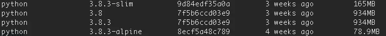

# Docker

## Images comparison

### **stretch/buster/jessie**

Images tagged with stretch, buster, or jessie are codenames for different [Debian releases](https://wiki.debian.org/DebianReleases). At the time of this writing, the stable Debian release is 10.4, and its codename is “Buster.” “Stretch” was the codename for all version 9 variations, and “Jessie” was the codename for all version 8 variations.

Future versions in development, but not yet stable, are “Bullseye” and “Bookworm.” You may start seeing these tags in the list of image versions on DockerHub.

### slim

The slim image is a paired down version of the full image. This image generally only installs the minimal packages needed to run your particular tool. In the case of python, that’s the minimum packages to run python and the same for node.js.

### alpine

Alpine images are based on the [Alpine Linux Project](https://alpinelinux.org/), which is an operating system that was built specifically for use inside of containers. For a long time, these were the most popular image variations due to their tiny size.

However, some teams are moving away from alpine because these images can cause compatibility issues that are hard to debug. Specifically, if using python images, some wheels are built to be compatible with Debian and will need to be recompiled to work with an Apline-based image.

The main reason to use an Alpine image is to make your resulting image as small as possible. The base image will be smaller than 5MB. The python base image (adding python to the base alpine image) is currently 78.9MB. That’s still very small.

This image is the most highly recommended if space is a concern.

### Network

Сеть Docker в основном используется для установления связи между контейнерами Docker и внешним миром через хост-машину, или вы можете сказать, что это коммуникационный канал, через который все изолированные контейнеры взаимодействуют друг с другом в различных ситуациях для выполнения необходимых действий.

Сетевая Docker подсистема подключается используя драйверы. По умолчанию существует несколько драйверов которые обеспечивают основные сетевые функции:

- **bridge**: Мост, — это сетевой драйвер по умолчанию. Бридж сеть используется, когда ваши приложения запускаются в автономных контейнерах, которые должны взаимодействовать между собой (Наглядный пример Nginx + MySQL).
- **host**: Хост, — это сетевой драйвер для автономных контейнеров (удаленная сетевая изоляция между контейнером и Docker хостом). Данный драйвер доступен только для docker-swarm с поддержкой Docker 17.06 и выше.
- **overlay/overlay2**: Оверлей (Наложенная сеть), — это сетевой драйвер для соединения несколько демонов Docker между собой и которые позволяют docker-swarm службам взаимодействовать друг с другом. Вы также можете использовать оверлейные сети для облегчения связи между docker-swarm и автономным контейнером или между двумя отдельными контейнерами на разных Docker демонах. Эта стратегия устраняет необходимость выполнения маршрутизации на уровне ОС между этими контейнерами.
- **macvlan**: Маквлан,- это сетевой драйвер, который позволяют назначать MAC-адрес контейнеру, делая его отображаемым как физическое устройство в вашей сети. Docker демон направляет трафик на контейнеры по их MAC-адресам. Использование macvlan драйвера иногда является лучшим выбором при работе с устаревшими приложениями, которые ожидают, что они будут напрямую подключены к физической сети.
- **none**: Нон,- это сетевой драйвер, который умеет отключать всю сеть для контейнеров. Обычно используется в сочетании с пользовательским сетевым драйвером.
- **Network plugins**: Вы можете установить и использовать сторонние сетевые плагины с Docker контейнерами. Эти плагины доступны в Docker Store или у сторонних поставщиков услуг.

**Где и что лучше использовать?**

- Мост (**bridge**) лучше всего использовать для связи нескольких контейнеров на одном и том же Docker хосте. Можно юзать docker-compose и выберать даную сеть для такой связки.
- Хост (**host**) сети лучше всего юзать, когда сетевой стек не должен быть изолирован от хоста Docker, но вы хотите, чтобы другие аспекты контейнера были изолированы.
- Овердейная сеть (**overlay/overlay2**) или наложение сетей лучше всего заюзать, когда вам нужны контейнеры, работающие на разных Docker хостах для связи, или, когда несколько приложений работают вместе, используя docker-swarm.
- Маквлан (**macvlan**) сети лучше всего использовать, когда вы переходите с VM/дедикейта на контейнеры или хотите, чтобы ваши контейнеры выглядели как физические хосты в вашей сети, каждый с уникальным MAC-адресом.
- Сторонние сетевые плагины позволяют интегрировать Docker со специализированными сетевыми стеками.

### Ports / Expose

Основное отличие между этими двумя  заключается в том, что `ports` опубликован и доступен на хост-машине, а также в указанной сети, в то время как `expose` опубликован только в определенной сети и доступен службам, работающим в этой же сети.